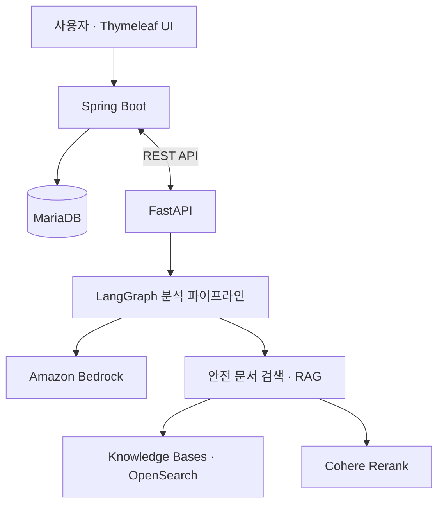

# 안전고리
### AI 기반 건설현장 안전관리 플랫폼

> 현장 사진을 활용한 위험요소 분석부터 조치 현황 관리와 보고서 작성까지 지원하는 서비스입니다.

2026 한이음 드림업 AI 프로젝트  
개발 기간: 2026.02 ~ 2026.10

## 프로젝트 소개

안전고리는 건설현장 관리자의 안전 점검 업무를 지원하기 위한 AI 플랫폼입니다.

현장 사진에서 위험요소를 분석하고, 관련 안전 문서를 검색해
관리자가 위험요소와 대응 방안을 검토할 수 있도록 돕습니다.
이후 담당 업체의 조치 현황과 보고서 작성까지 하나의 흐름으로 관리하는 것을 목표로 합니다.

## 개발 배경

건설현장 안전관리 업무는 위험요소 확인뿐 아니라 담당자 전달,
조치 결과 확인, 점검 기록 작성까지 이어집니다.

안전고리는 이러한 업무를 연결하여 다음 문제를 개선하고자 합니다.

- 현장 사진과 점검 기록이 분산되어 관리되는 문제
- 위험요소에 맞는 안전 기준과 참고 자료를 찾는 부담
- 원청과 하청 간 조치 요청 및 진행 상황 확인의 어려움
- 반복적인 안전관리 보고서 작성 업무

## 주요 기능 및 개발 목표

| 기능 | 설명 |
| --- | --- |
| 현장 사진 기반 위험요소 분석 | AI를 활용해 사진 속 위험요소 분석 지원 |
| 안전 문서 검색 | RAG를 활용해 관련 법령·사고사례·점검기준 검색 |
| 위험요소 조치 관리 | 원청의 조치 요청과 하청의 진행 상황 관리 |
| 조치 기한 알림 | 기한을 초과한 항목에 대해 담당자 SMS 알림 |
| 보고서 생성 | 점검 결과와 조치 내역을 활용한 안전관리·TBM 보고서 작성 지원 |
| 대시보드 | 현장별 위험요소와 조치 현황 확인 |

※ 구현 완료·개발 중·예정 여부는 기능별 개발 현황에 맞게 업데이트합니다.

## 서비스 이용 흐름

현장 선택 → 사진 등록 → AI 분석 결과 확인 → 조치 입력 → 보고서 생성

관리자가 AI 분석 결과를 검토하고, 필요한 조치를 등록하여
후속 처리와 기록 관리로 연결합니다.

## 시스템 구성

- **Spring Boot**: 인증, 비즈니스 로직, 데이터 관리
- **FastAPI**: AI 분석 및 보고서 생성 파이프라인
- **RAG**: 관련 안전 문서를 검색하여 분석·보고서 작성에 활용

## 기술 스택

| 구분 | 기술 |
| --- | --- |
| Backend | Java, Spring Boot, Spring Data JPA |
| Frontend | Thymeleaf |
| AI Server | Python, FastAPI, LangGraph |
| Database | MariaDB |
| AI · 검색 | Amazon Bedrock, Knowledge Bases, OpenSearch, Cohere Rerank |
| 파일 저장 · 알림 | Amazon S3, Amazon SNS |
| Build · 협업 | Gradle, Git, GitHub |

## 주요 화면

<!-- 실제 구현 화면을 추가합니다. -->
<!-- 예:  -->

추가 예정

## 팀 구성

| 이름 | 담당 역할 | 주요 구현 내용 |
| --- | --- | --- |
| 이름 입력 | 역할 입력 | 구현 내용 입력 |

## 개발 일정

| 기간 | 주요 내용 |
| --- | --- |
| 2~3월 | 아이디어 구체화 및 요구사항 분석 |
| 4~5월 | 시스템·DB 설계 및 개발환경 구성 |
| 5~8월 | AI 분석, RAG, 보고서 생성 및 관리 기능 개발 |
| 8~9월 | 통합 테스트 및 개선 |
| 9~10월 | 결과 정리 및 최종 산출물 작성 |
